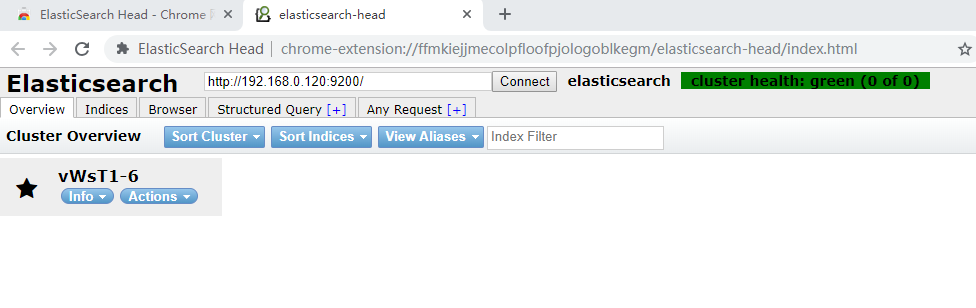

# 一、Elastic Search安装

## 1.创建elsearch用户，Elasticsearch不支持root用户运行 

useradd elsearch 

## 2.解压安装包 

tar -xvf elasticsearch-6.5.4.tar.gz -C /itcast/es/

## 3.修改配置文件 

vim config/elasticsearch.yml 

network.host: 0.0.0.0 #设置ip地址，任意网络均可访问 

\#说明：在Elasticsearch中如果，network.host不是localhost或者127.0.0.1的话，就会认为是生产环境， 

会对环境的要求比较高，我们的测试环境不一定能够满足，一般情况下需要修改2处配置，如下： 

## 4.修改jvm启动参数 

```sh
vim conf/jvm.options 

-Xms128m #根据自己机器情况修改 
-Xmx128m 
【测试】
-Xms512m
-Xmx512m
```


## 5.一个进程在VMAs(虚拟内存区域)创建内存映射最大数量 

```sh
vim /etc/sysctl.conf 

vm.max_map_count=655360 

sysctl -p #配置生效 
```

## 6.解决系统配置问题

\#启动出错，环境：Centos7.4

### 6.1 报错：[1]: max file descriptors [4096] for elasticsearch process is too low, increase to at least [65536] 

解决：切换到root用户，编辑limits.conf 添加类似如下内容 

vi /etc/security/limits.conf 

添加如下内容: 

```sh
* soft nofile 65536
* hard nofile 131072
* soft nproc 2048
* hard nproc 4096
```


### 6.2 [2]: max number of threads [1024] for user [elsearch] is too low, increase to at least [4096] 

【这个在centos7.4安装的时候，没有发生】

解决：切换到root用户，进入limits.d目录下修改配置文件。 

vi /etc/security/limits.d/90-nproc.conf 

```sh
修改如下内容： 
* soft nproc 1024 
修改为 
* soft nproc 4096
```


### 6.3 关闭防火墙

```sh
systemctl stop firewalld.service
systemctl disable firewalld.service #禁止防火墙开机启动
```


## 6.启动ES服务 

```sh
su - elsearch 

cd bin 

./elasticsearch 或 ./elasticsearch -d #后台启动
```


通过访问连接http://192.168.0.120:9200/进行测试，看到如下信息，就说明ES启动成功了 

```sh
{
  "name" : "vWsT1-6",
  "cluster_name" : "elasticsearch",
  "cluster_uuid" : "XN4L-mM-TvOFT2L_5CWqWw",
  "version" : {
    "number" : "6.5.4",
    "build_flavor" : "default",
    "build_type" : "tar",
    "build_hash" : "d2ef93d",
    "build_date" : "2018-12-17T21:17:40.758843Z",
    "build_snapshot" : false,
    "lucene_version" : "7.5.0",
    "minimum_wire_compatibility_version" : "5.6.0",
    "minimum_index_compatibility_version" : "5.0.0"
  },
  "tagline" : "You Know, for Search"
}
```


"name": "dSQV6I8", 

"cluster_name": "elasticsearch", 

"cluster_uuid": "v5GPTWAtT5emxFdjigFg-w", 

"version": { 

"number": "6.5.4", 

"build_flavor": "default", 

"build_type": "tar", 

"build_hash": "d2ef93d", 

"build_date": "2018-12-17T21:17:40.758843Z", 

"build_snapshot": false, 

"lucene_version": "7.5.0", 

"minimum_wire_compatibility_version": "5.6.0", 

"minimum_index_compatibility_version": "5.0.0" 

},

"tagline": "You Know, for Search" 

}

## 7.停止服务 

root@itcast:~# jps 

68709 Jps 

68072 Elasticsearch


# 二、elasticsearch-head

由于ES官方并没有为ES提供界面管理工具，仅仅是提供了后台的服务。elasticsearch-head是一个为ES开发的一个页
面客户端工具，其源码托管于GitHub，地址为：https://github.com/mobz/elasticsearch-head

## 1.head提供了4种安装方式：

源码安装，通过npm run start启动（不推荐）
通过docker安装（推荐）

通过chrome插件安装（推荐）
通过ES的plugin方式安装（不推荐）

## 2.通过docker安装（推荐）【安装失败】

```sh
#拉取镜像 
docker pull mobz/elasticsearch-head:5 
#创建容器 
docker create --name elasticsearch-head -p 9100:9100 mobz/elasticsearch-head:5 
#启动容器 
docker start elasticsearch-head
```

### 注意：由于前后端分离开发，所以会存在跨域问题，需要在服务端做CORS的配置，如下：

```sh
vim elasticsearch.yml
http.cors.enabled: true http.cors.allow-origin: "*"
通过chrome插件的方式安装不存在该问题。
```

## 3.chrome插件的方式安装【安装成功】

打开chrome的应用商店，即可安装https://chrome.google.com/webstore/detail/elasticsearch-head/ffmkiejjmecolpfloofpjologoblkegm



